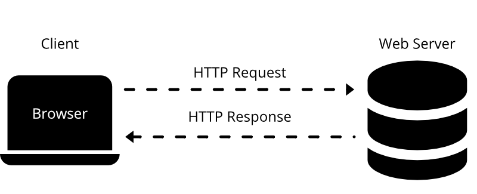
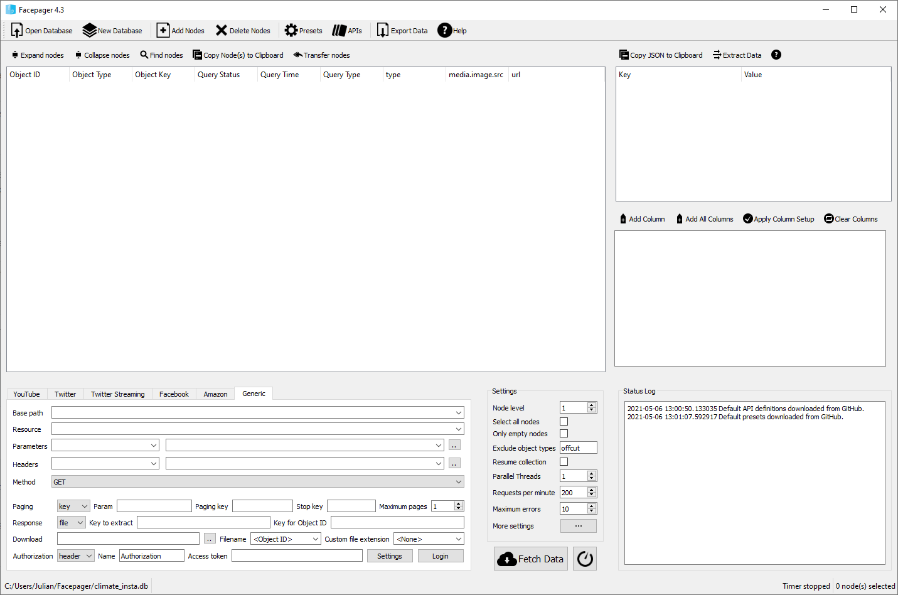
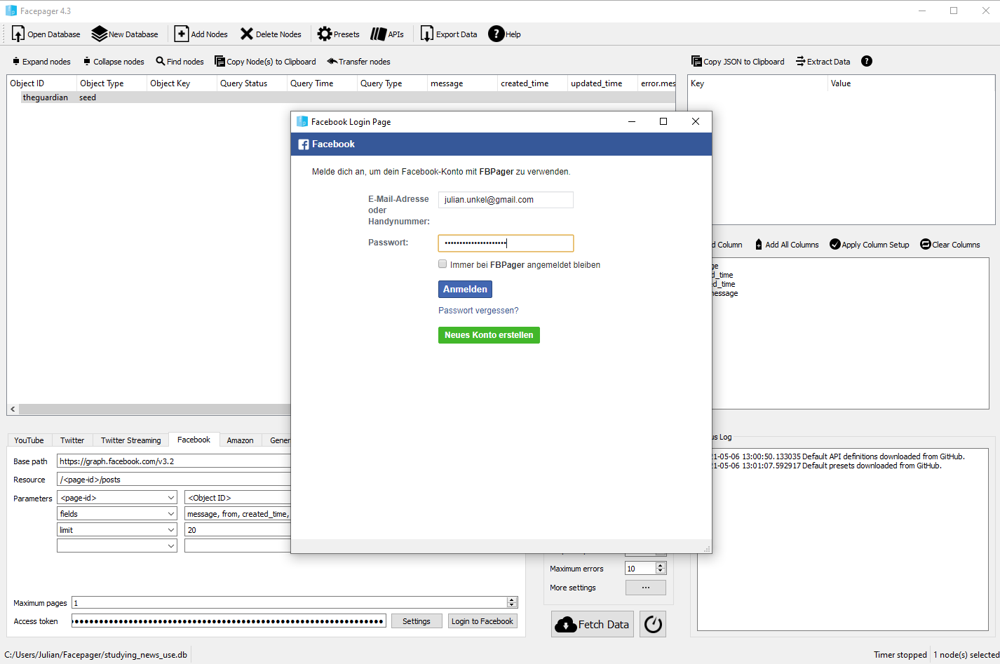
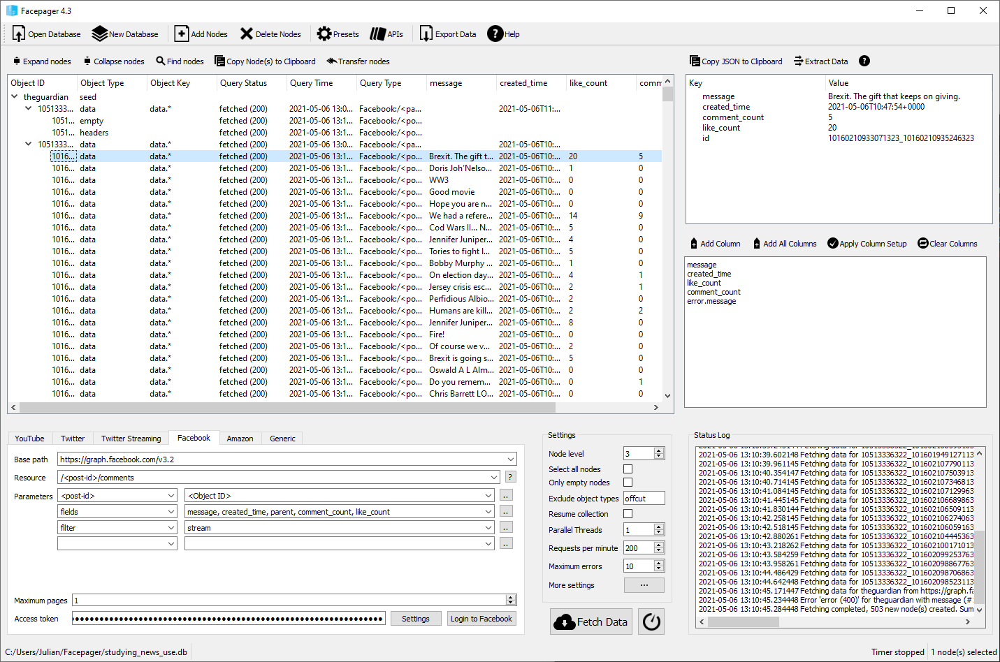
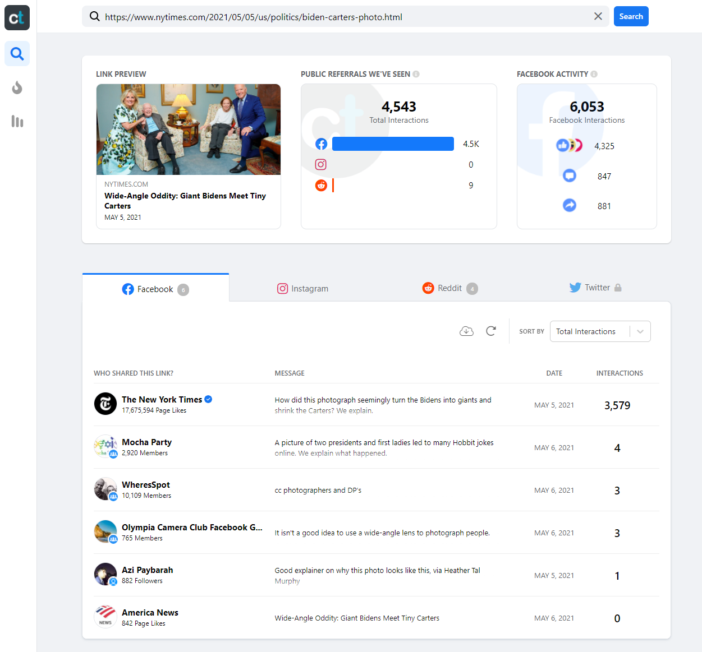
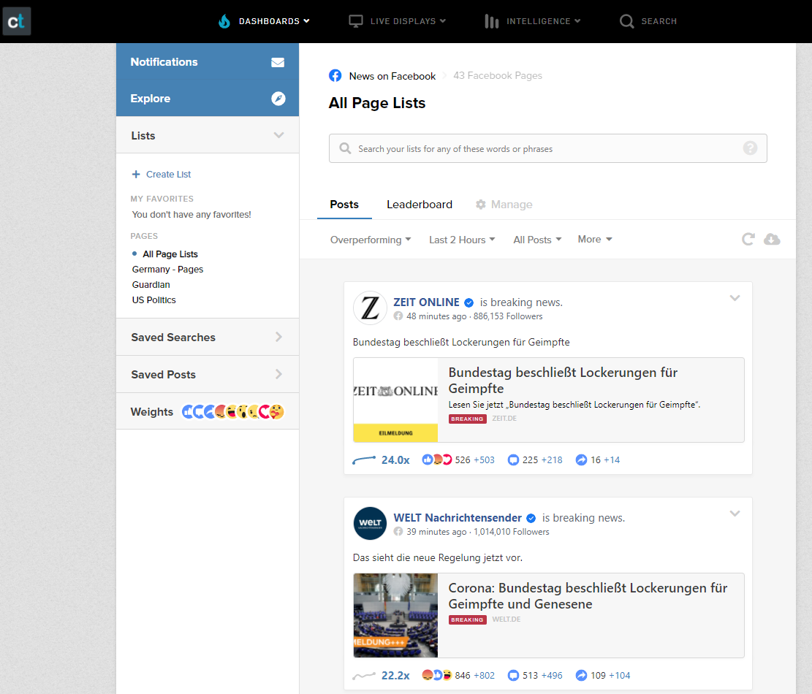

# Agenda

.pull-left[As we have seen in the previous sessions, social media play a key role for users' news consumption. 

By their design, they record human behavior (and thus news use behavior) as _digital traces_ of users engaging and interacting (clicking on news links, liking news posts, writing comments on said posts) with social media posts.

In this session, we will deal with common approaches to collect digital trace data from social media.
]

--

.pull-right[Our agenda today:

- API requests
  - Basics
  - Calling APIs with R
- API wrapper packages
  - Basics
  - Example: Querying the Twitter API with `rtweet`
  - Twitter's Academic API track
- Facepager
- Social monitoring services
  - CrowdTangle
  - Other commercial options
- <span style="color: #bbbbbb">Grey area tools</span>
]

---
class: middle

# API requests

---

# Basics: HTTP requests

.pull-left[
Think of accessing data on web servers (e.g., by opening a web site in a browser) via **HTTP** (Hypertext Transfer Protocol) as ordering a package via mail:

- First, we place an order with our client, for example by typing an URL into a browser (*Request*)
- The server sends our client a package (*Response*), consisting of two parts:
  - _Header_: Sort of like the packing slip; contains lots of meta information, for example whether our package was delivered successfully
  - _Body_: The actual content of the package, for example an HTML file

]

.pull-right[

HTTP requests in the client-server model
]

---

# Basics: HTTP methods & status codes


There are several different **request methods**, most importantly:

- _GET_: Request data retrieval
- _POST_: Request sending (=posting) data (e.g., web forms)

--

Response headers contain three-digit **status** codes that tell us if everything went okay or what went wrong. Most importantly:

- _2xx_: Success! We usually want code _200_, telling us that everything is OK
- _4xx_: Oh no, client error! This means: The problem is caused by the client (i.e., us). You have probably already encountered these:
  - *403*: Forbidden - client is not allowed to access the requested resource
  - *404*: Not found - client requested a resource that is not available on the server
- *5xx*: Oh no, server error! For example, _503_ (service unavailable) tells us that the server is (currently) to busy to handle our request. 

---

# Basics: Writing HTTP requests in R

We can write our own HTTP requests in R using the `httr` package. Let's install it if we haven't done so already:

```{r eval=FALSE}
install.packages("httr")
```

--

After loading the package, we can use functions named after the request methods to send HTTP requests. Let's request your [SEDS home page](https://www.wiwi.uni-konstanz.de/studium/master-of-science/seds/).

```{r eval=FALSE}
library(httr)
seds_resp <- GET("https://www.wiwi.uni-konstanz.de/studium/master-of-science/seds/")
```

```{r echo=FALSE}
library(httr)
seds_resp <- readRDS("offline_data/1/seds_resp.rds")
```

--

The response is a list object containing the 'whole package'. Let's first take a look at the status code:

```{r}
status_code(seds_resp)
```

Everything went OK!

---

# Basics: Writing HTTP requests in R

We can now investigate the body - the actual content - of our response object:

```{r}
content(seds_resp)
```

The first lines tell us that we have successfully requested an `html_document`. We will deal with working with HTML documents in the next session. But you can already see the first level of contents of the HTML file, namely a `<head>` with meta information, the `<body>` containing all the text of the website (not to be confused with the header and the body of the *response*), and various `<script>`s.

---

# Basics: What's in a URL?

We access resources on the web by providing the corresponding **URL** (Uniform Resource Locator). Let's take a closer look:

<span class="vibrant-1">`https`</span>`://`<span class="vibrant-2">`www.google.de`</span><span class="vibrant-3">`/search`</span><span class="vibrant-4">`?q=seds`</span>

--

- <span class="vibrant-1">Scheme</span>: The scheme specifies the protocol that we are using (HTTPS is a secure version of HTTP)
- <span class="vibrant-2">Domain</span>: The domain name indicates the web server that is being requested
- <span class="vibrant-3">Path</span>: The path points to the specific resource on the web server, just like the folder structure on your computer. It can include the file name (e.g., `/path/to/page.html`), but on web pages, this is usually handled on the server side.
- <span class="vibrant-4">Parameters</span>: Web servers may accept parameters in a `key=value` combination to dynamically provide content for a specific resource. They are separated from the path by a single `?`. Multiple parameters can be linked by `&` (e.g., `?key1=value1&key2=value2`).

In the above example, we are thus requesting the resource at path `/search` with the parameter `q` set to `seds` of the domain `www.google.de` via the HTTPS protocol: [https://www.google.de/search?q=seds](https://www.google.de/search?q=seds)

--

We can add other parameters to change the output: [https://www.google.de/search?q=seds&start=10](https://www.google.de/search?q=seds&start=10)

---

# Basics: JSON

Web-APIs usually do not return HTML files, but more structured data, most often in the **JSON** (JavaScript Object Notation, pronounced as in ["Jason and The Argonauts"](https://www.ecma-international.org/wp-content/uploads/ECMA-404_2nd_edition_december_2017.pdf)) format. This open, human-readable and flexible text format is able to represent various (also hierarchical and nested) data structures in attribute-value pairs. We will deal with JSON files soon, but the example from [Wikipedia](https://en.wikipedia.org/wiki/JSON) probably already tells you all the basics you need to know:

```{json}
{
  "firstName": "John",
  "lastName": "Smith",
  "isAlive": true,
  "age": 27,
  "address": {
    "streetAddress": "21 2nd Street",
    "city": "New York",
    "state": "NY",
    "postalCode": "10021-3100"
  },
  "phoneNumbers": [
    {
      "type": "home",
      "number": "212 555-1234"
    },
    ...
```

---

# APIs

**APIs** (application programming interfaces) are interfaces of software applications to communicate (e.g., share data) with other applications. 

In our context, the term usually references Web APIs, interfaces of web applications/servers using request-response systems. 

--

All Web APIs are different and thus require some engagement with the (hopefully helpful) documentation: 
- access requirements
- endpoints and parameters
- response data structures

--

But all Web APIs are the same:
- we write an HTTP request to the API URL
- the API responds by providing the requested data (usually in JSON, XML, or CSV)

---

# APIs: Authentication & Rate limits

Access to APIs is regulated in many different ways, for example:

- Open (can be called without any authentication)
- Username/password
- API key (often passed as a URL parameter)
- OAuth (a protocol for generating user- or session-specific authentication tokens)

In all but the first case, this requires (often reviewed or even paid) registration.

--

APIs usually manage access by setting **rate limits**, defining how many calls a user can make within a given time period. Exceeding the rate limit may result in:

- Request errors (e.g., 429 Too Many Requests)
- Request throttling
- Fees (in commercial APIs)

---

# APIs: Endpoints & Parameters

Most APIs offer several **endpoints** for specific actions. Endpoints are thus a combination of an URL path and an HTTP request method. 

For example, some endpoints of the Twitter API v2, using the base URL `https://api.twitter.com` are:

- `GET /2/tweets`: Get information about tweets
- `GET /2/users/:id/tweets`: Get tweets of the Twitter user with the id `:id`
- `POST /2/users/:id/likes`: Like a tweet on behalf of the Twitter user with the id `:id`

--

Calls to endpoints are then usually specified further by providing **parameters**, either as URL parameters or, for example when using the POST method, in the request body.

- For `GET /2/tweets`, we would add a list of tweet IDs to our call by adding the parameter `ids` (e.g, `GET https://api.twitter.com/2/tweets?ids=id1,id2,id3`)
- For `POST /2/users/:id/likes`, we would add the id of the target tweet in the request body in JSON format (e.g., `{"tweet_id": "id1"}`)

---

# APIs: Social Media

[Programmable Web](https://www.programmableweb.com/) provides an overview of about 25,000 APIs you may want to use.

Common social media APIs are:

- **Twitter API** (https://developer.twitter.com/en/docs/twitter-api)
  - Access to Twitter tweets, timelines, profiles, etc.
  - *Will I get access?* Likely, through the [Academic Research track](https://developer.twitter.com/en/solutions/academic-research)
- **Facebook Graph API** (https://developers.facebook.com/docs/graph-api)
  - Acces to Facebook posts, comments, profiles, etc.
  - *Will I get access?* Unlikely (but wait for the rest of the session)
- **Facebook Ad Library API** (https://www.facebook.com/ads/library/api)
  - Access to political Facebook ads (content, reach, spendings, etc.) 
  - *Will I get access?* Very likely
- **Instagram Graph API** (https://developers.facebook.com/docs/instagram-api)
  - Access to Instagram posts, profiles, etc.
  - *Will I get access?* Unlikely (but wait for the rest of the session)
- **Reddit API** (https://www.reddit.com/dev/api/)
  - Reddit submissions, comments, etc.
  - *Will I get access?* Actually haven't tried it (because see next slide)
  
---

# The Pushshift API

**Pushshift** is a privately maintained, open Reddit dataset, ingesting Reddit content in real time. For technical details, see the paper [The Pushshift Reddit Dataset](https://arxiv.org/pdf/2001.08435.pdf).

The dataset is accessible, among other pathways, via a public, open API: https://api.pushshift.io, documented at https://github.com/pushshift/api.

Main advantages over the 'real' Reddit API:

- No authentication required
- Larger response object limits
- Very forgiving rate limits

Drawbacks:

- Unclear state of development, incomplete documentation
- Some issues with deleted posts
- Likely coverage issues

---

# Calling the Pushshift API with R

Let's write our first API call! The base URL of the Pushshift API is https://api.pushshift.io, so we might want to store this for easier retrieval:

```{r}
ps_base <- "https://api.pushshift.io"
```

--

As seen in the [documentation](https://github.com/pushshift/api), the API currently offers two endpoints, both for `GET` methods:

- `/reddit/search/comment`: Searching individual comments
- `/reddit/search/submission`: Searching submissions

Let's store them as well:

```{r}
ps_comment <- "/reddit/search/comment"
ps_submission <- "/reddit/search/submission"
```

---

# Calling the Pushshift API with R

The `GET()` function of `httr` offers several arguments to construct a response from the different parts of the call URL. We can use the `url` argument to add the base URL (domain), define the path using the `path` arguments, and add several parameters by passing a named list of key/value pairs to the argument `query`.

In the following, we call the submission endpoint of the API, searching for the latest 100 submissions in the [r/news](https://www.reddit.com/r/news) subreddit that contain the word `"biden"` in the submission title:

```{r eval=FALSE}
ps_resp <- GET(url = ps_base,
               path = ps_submission,
               query = list(subreddit = "news",
                            title = "biden",
                            size = 100)
               )
```

```{r echo=FALSE}
ps_resp <- readRDS("offline_data/1/ps_resp.rds")
```

---

# Calling the Pushshift API with R

Let's take a look:

```{r}
ps_resp
```

---

# Calling the Pushshift API with R

We can 'unpack' the response body by using the `content()` function:

```{r}
ps_content <- content(ps_resp, type = "application/json")
str(ps_content, max.level = 1)
```

--

Further moving through the list levels, we can access information about the individual entries:

```{r}
ps_data <- ps_content$data
ps_data[[1]]$title
```

(Your results may vary as I'm using a cached response in this presentation.)

---

# Calling the Pushshift API with R

Using some [Tidyverse](https://www.tidyverse.org/) functions - specifically, from the `purrr` package for functional programming - we can quickly transform the response to a rectangular dataframe:

```{r}
library(tidyverse)
fields <- c("id", "title", "created_utc", "permalink", "url")
ps_data %>% 
  map_dfr(magrittr::extract, fields)
```

---

# Calling the Pushshift API with R

**Exercise 1: Write your own call:** 
Try to obtain the *first* 50 posts that were posted in German-language subreddit [r/de](https://www.reddit.com/r/de). Consult the documentation for help on the necessary parameters: https://github.com/pushshift/api

<center></center>

---

# APIs: Iteration & Pagination

If an API call matches more results than can be returned with a single response, we need an iteration mechanism to retrieve all results. For example, if the call matches 500 results and the response object limit is 100, we need to make (at least) 5 calls to retrieve all results. Keep rate limits in mind when iterating over results!

Most APIs provide one or more of the following forms of pagination:

- **Pages**: Results are spread over pages (e.g., results 1 to 100 on page 1, 101 to 200 on page 2). We can then iterate over results by simply adding 1 to the page number (e.g., by adding the query parameter `page=page_num`) in each successive call.
- **Keys**: Results are ordered by ascending/descending keys (e.g., Tweet IDs). We can then iterate over results by retrieving the minimum/maximum key of each call and requesting results below/above said key in the next call.
- **Timestamps**: Results are ordered by UNIX timestamps or [DIN ISO 8601](https://en.wikipedia.org/wiki/ISO_8601) date formats. We can then iterate over results by retrieving the minimum/maximum timestamp of each call and requesting results before/after said timestamp in the next call (but beware that multiple results can have the same timestamp).
- **Cursors**: Results are spread over pages, but single pages are identified by an opaque cursor (i.e., usually a seemingly random sequence of characters) instead of integer numbers. We can then iterate over results by retrieving the cursor for the next/previous page which should be provided in the response.

---

# Calling the Pushshift API with R

**Exercise 2: Pagination:** 
Try to obtain the *latest* 200 comments posted in the [r/politics](https://www.reddit.com/r/politics) subreddit that contain the phrase "lol". Consult the documentation for help on the necessary parameters: https://github.com/pushshift/api

<center></center>

---
class: middle

# API wrapper packages

---

# API wrapper packages

**API wrappers** are language-specific packages that simplify calling specific APIs. In addition to providing convenience functions for the actual calls, they sometimes also include pagination and rate limit handling.

--

You will probably find R wrapper packages for most common APIs. If in doubt, just google `"r + API name"`.

--

If there is none, why not do some good and create your own wrapper package? Some resources:

- [CRAN: Best practices for API packages](https://cran.r-project.org/web/packages/httr/vignettes/api-packages.html)
- [Colin Fay: How to build an API wrapper package in 10 minutes](https://colinfay.me/build-api-wrapper-package-r/)

---

# Example: `rtweet`

[`rtweet`](https://github.com/ropensci/rtweet) is probably the most common Twitter API wrapper package for R (and also somewhat *official*, as it is co-developed by the RStudio team). 

Results follow tidy data conventions and are thus easily processed further; furthemore, the package can be used without access to Twitter's developer API (but you will still need a Twitter account, and a developer account is highly encouraged for large-scale data collection).

Currently, the package is not (yet) optimized for Twitter's API v2 (and thus the academic research track).

```{r eval=FALSE}
install.packages("rtweet")
```

---

# Example: `rtweet`

Let's download the latest 1000 tweets containing `#impfung`.

```{r eval=FALSE, message=FALSE}
library(rtweet)
vac_tweets <- search_tweets("#impfung", n = 1000, include_rts = FALSE)
vac_tweets
```
```{r echo=FALSE, message=FALSE}
library(rtweet)
vac_tweets <- readRDS("offline_data/1/vac_tweets.rds")
vac_tweets
```

---

# Example: `rtweet`

**Exercise 3: `rtweet`:** 
Try to obtain both the latest 500 tweets posted by Annalena Baerbock, Armin Laschet & Olaf Scholz, and the 500 latest tweets favorited by them. Consult the documentation for help on the necessary functions: https://github.com/ropensci/rtweet

<center></center>

---

# Wrappers for Twitter's Academic API

Twitter's new API v2 offers an [Academic Research track](https://developer.twitter.com/en/solutions/academic-research) free for non-commercial academic research, including master's students. It includes access to the full Twitter archive ('historic data') and offers high rate and tweet limits (up to 10,000,000 tweets per month).

--

As the academic track is still new, there is not one definitive wrapper package (and most are still in active development). Choose your fighter:

- [`academictwitteR`](https://github.com/cjbarrie/academictwitteR)
- [`RTwitterV2`](https://github.com/MaelKubli/RTwitterV2)
- [`twitterAcademic`](https://github.com/kasperwelbers/twitterAcademic)
- [`twitteRacademic`](https://github.com/mittendo/twitteRacademic) (note the different capital letter)

---
class: middle

# Facepager

---

# Facepager

[Facepager](https://github.com/strohne/Facepager) is a tool for automated data collection (APIs, webscraping) of publicly available data.

.pull-left[
Main advantages:

- Free and open source
- Easy to use
- Good [documentation](https://github.com/strohne/Facepager/wiki) and [tutorial videos](https://www.youtube.com/channel/UCiIbKv5b5rz-6LPTLQgVGug)
- Several presets for common use cases
- App-level access to Facebook Graph API

Drawbacks:

- some outdated information on the Wiki
- Potential bottleneck of app-level rate limits
]

.pull-right[

]

---

# Fetching Facebook data with Facepager

Apart from providing a point-and-click solution to API calls, the main advantage is the app-level access to Facebook's Graph API. Thus, it is possible to obtain data from public Facebook pages (including comments!) without an own Developer API authorization (however, you still need a Facebook account).

There are also presets for the most common tasks (fetching page data, fetching posts from pages, fetching comments from posts).

--

.pull-left[

Getting started - fetching posts and comments:

1. [Download and install Facepager](https://github.com/strohne/Facepager/releases)
2. Create new local database
3. Login to Facebook via Facepager
4. Add Facebook pages as nodes (id or name)
5. Fetch posts for these pages using preset "2 Get Facebook posts"
6. Switch node level to `2` and fetch comments using preset "3 Get comments".
7. Data can be exported as a CSV file for further analysis.
]

.pull-right[


]

---

# Fetching Facebook data with Facepager



---
class: middle

# Social monitoring services

---

# Social monitoring services

Social monitoring services are (commercial) services for, ahem, monitoring social media, for example:

- [Crowdtangle](https://www.crowdtangle.com/)
- [Synthesio](https://www.synthesio.com/)
- [BuzzSumo](https://buzzsumo.com/)

--

.pull-left[
Advantages:

- Easy to use, dashboards
- App-level API access
- Monitor multiple social media at once

]

.pull-right[
Drawbacks:

- Commercial and often costly
- Not primarily made for research
- Intransparent (coverage?)

]

---

# CrowdTangle

[Crowdtangle](https://www.crowdtangle.com/) is a social monitoring service owned by Facebook.

.pull-left[
- Access to both public Facebook & Instagram data (but no comments)
- Free [academic track](https://help.crowdtangle.com/en/articles/4302208-crowdtangle-for-academics-and-researchers) (but currently only PhD students+ and subject to application)
- [Own API](https://help.crowdtangle.com/en/articles/1189612-crowdtangle-api) for programmatic access 
- Time-series data on posts
- Some preprocessing included (e.g., image text recognition for Instagram posts)
- Lisa or Julian can provide data ;) 
]

.pull-right[

]

---

# CrowdTangle

.pull-left[
Example Facebook dashboard:


]

.pull-right[
Example Instagram dashboard


]

---

# CrowdTangle

Sample data:

```{r echo=FALSE, message=FALSE}
read_csv("data/ct_fb_posts.csv")
```

---

# CrowdTangle

Sample post time-series data:

```{r echo=FALSE, message=FALSE}
read_csv("data/ct_single_post.csv") %>% 
  arrange(Timestep)
```

---
class: middle

# Grey area tools

---

# Grey area tools

As Bruns (2019) noted, "break[ing] the rules" (p. 16) is one way to deal with an increasingly restrictive API landscape. For most social media platforms, there are several 'unofficial' tools like [TikTok-API](https://github.com/davidteather/TikTok-Api) or [Instaloader](https://instaloader.github.io/) to access (public) data.

--

These tools often make use of:

- Browser emulation
- Web scraping
- Private APIs

--

They are often the only viable way for automated data fetching from these platforms. They are also likely violating the platforms' ToS (but [German law may be on your side](https://papers.ssrn.com/sol3/papers.cfm?abstract_id=3491192)) and are subject to cease working at a moment's notice.

Use them if you want and need to, but always have a backup plan available.

---
class: middle

# Exercise solutions

---

# Exercise solutions

Exercise 1:

```{r eval=FALSE}
ex1_resp <- GET(url = ps_base,
                path = ps_submission,
                query = list(subreddit = "de",
                             sort = "asc")
                )
```

---

# Exercise solutions

Exercise 2:

```{r eval=FALSE}
# Get first 100 comments
ex2_resp_1 <- GET(url = ps_base,
                  path = ps_comment, 
                  query = list(q = "lol",
                               subreddit = "politics",
                               size = 100))
ex2_data_1 <- content(ex2_resp_1)$data

# Extract timestamp of last result
last_comment_timestamp <- tail(ex2_data_1, 1)[[1]]$created_utc

ex2_resp_2 <- GET(url = ps_base,
                  path = ps_comment, 
                  query = list(q = "lol",
                               subreddit = "politics",
                               size = 100,
                               before = last_comment_timestamp))

```

(Note that to make sure we do not miss any comments posted at the same time, we could add +1 to the `last_comment_timestamp` and then filter out eventual duplicates.)

---

# Exercise solutions

Exercise 3:

```{r eval=FALSE}
candidates <- c("ABaerbock", "ArminLaschet", "OlafScholz")
timelines <- get_timelines(candidates, n = 500)
favs <- get_favorites(candidates, n = 500)
```

(Note that the `favs` tibble contains one additional variable, indicating `favorited_by`)

---

class: middle
# Thanks

Credits:
- Slides created with [`xaringan`](https://github.com/yihui/xaringan)
- Title image by [Tracy Le Blank / Pexels](https://www.pexels.com/de-de/foto/person-mit-iphone-die-den-ordner-fur-soziale-netzwerke-anzeigt-607812/)
- Icons by [Bootstrap](https://icons.getbootstrap.com/)
- Coding cat gif by [Memecandy/Giphy](https://giphy.com/gifs/memecandy-LmNwrBhejkK9EFP504)