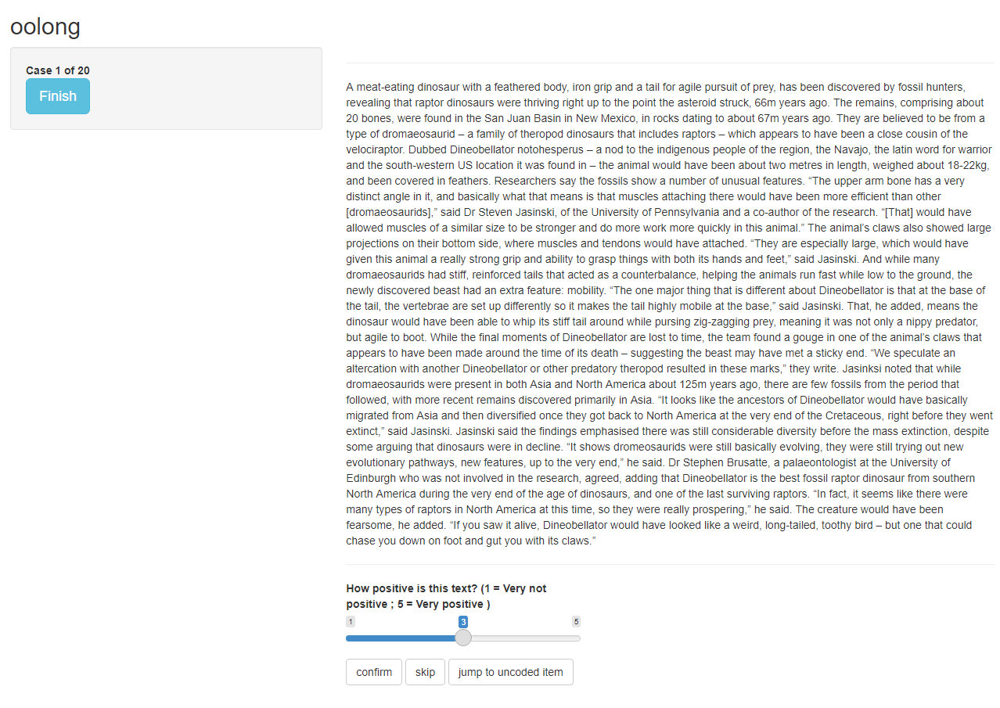

# Agenda

.pull-left[At it's most basic, automated content analysis is just counting stuff: most frequent words, co-occuring words, specific words, etc.

We can already learn a lot about a corpus of documents just by looking at word metrics and applying dictionaries. Even if they are not part of the main research interest, it still might prove useful to use the following methods to describe and familiarize yourself with a large text corpus.
]

--

.pull-right[Our agenda today:

- Text description and word metrics
  - Frequencies
  - Keywords in context
  - Collocations
  - Cooccurences
  - Lexical complexity
  - Keyness
- Dictionary-based methods
  - Basics
  - Applying categorical dictionaries
  - Applying weighted dictionaries
  - Validating dictionaries
]

---
class: middle

# Text description and word metrics

---

# Setup

We will be mainly using the packages known from the last few sessions:

```{r}
library(tidyverse)
library(tidytext)
library(quanteda)
library(quanteda.textstats)
```

---

# Setup

We will be working with a sample of 10,000 Guardian articles published in 2020:

```{r eval=FALSE}
guardian_tibble <- readRDS("data/guardian_sample_2020.rds")
```

```{r echo=FALSE}
guardian_tibble <- readRDS("temp/guardian_sample_2020.rds")
```

---

# Setup

Before we start, let's add a column indicating the day the respective article was published in an extra column (you'll soon enough see why):

```{r}
guardian_tibble <- guardian_tibble %>% 
  mutate(day = lubridate::date(date))
```

```{r}
guardian_tibble %>% 
  select(date, day)
```

---

# Preprocessing

Just like last time, we'll do some preprocessing of our data by creating a corpus object, tokenizing all documents and creating a DFM. 

Keep all of these objects, as different methods require differently structured data.

```{r}
guardian_corpus <- corpus(guardian_tibble, 
                          docid_field = "id", text_field = "body")

guardian_tokens <- guardian_corpus %>% 
  tokens(remove_punct = TRUE, remove_symbols = TRUE, remove_numbers = TRUE,
         remove_url = TRUE, remove_separators = TRUE) %>% 
  tokens_tolower()

guardian_dfm <- guardian_tokens %>% 
  dfm()
```

---

# Word frequencies

`featfreq()` counts all features. Not that the resulting list is not sorted:

```{r}
featfreq(guardian_dfm)
``` 

---

# Word frequencies

`topfeatures()` returns the *n* most common features (default: 10):

```{r}
topfeatures(guardian_dfm)
```

---

# Word frequencies

Some more options, including grouping for docvars, are available with `textstat_frequency()`:

```{r}
textstat_frequency(guardian_dfm, n = 5, groups = pillar)
```

---

# Word frequencies

Let's get some more useful results by removing stopwords:

```{r}
dfm_remove(guardian_dfm, stopwords("english")) %>% 
  textstat_frequency(n = 5, groups = pillar)
```

---

# Word frequencies

More relevant features emerge after some strong trimming of the DFM:

```{r}
dfm_trim(guardian_dfm, max_docfreq = .20, docfreq_type = "prop") %>% 
  textstat_frequency(n = 3, groups = pillar)
```

---

# Keywords in context

Use `kwic()` to get a view of up to 1000 occurences of a keyword in a given context window (default: 5 words before/after):

```{r}
kwic(guardian_tokens, "belarus") %>% 
  as_tibble()
```

---

# Keywords in context

Use `phrase()` for multi-word keywords and set window size with `window`:

```{r}
kwic(guardian_tokens, phrase("champions league"),
     window = 3) %>% 
  as_tibble()
```

---

# Collocations

*Collocations* define words directly appearing after each other and can be computed with `textstat_collocations()`. The output is sorted by the $\lambda$ parameter, which increases if *exactly* this combination of words is more common than the same words appearing in other collocations. Note that this can be very computationally expensive, so adjust the `min_count()` parameter accordingly:

```{r}
guardian_tokens %>% 
  tokens_remove(stopwords("english")) %>% 
  textstat_collocations(min_count = 100) %>% 
  as_tibble()
```

---

# Collocations

We can look for multi-word collocations of any size by adjusting the `size` parameter:

```{r}
guardian_tokens %>% 
  tokens_remove(stopwords("english")) %>% 
  textstat_collocations(min_count = 10, size = 4) %>% 
  as_tibble()
```

---

# Cooccurences

*Cooccurences* look for words appearing in the same document (and not just directly after each other). 

Cooccurences are best represented as a *feature cooccurence matrix* of size `n_features * n_features`. Create one with `fcm()`. Again, to decrease computational load, some trimming of the DFM may be useful:

```{r}
guardian_fcm <- guardian_dfm %>% 
  dfm_remove(stopwords("english")) %>% 
  dfm_trim(min_termfreq = 100, max_docfreq = .25, docfreq_type = "prop") %>% 
  fcm()
```

---

# Cooccurences

```{r}
guardian_fcm
```

---

# Cooccurences

A simple way to get at the most common cooccurences is by transforming the FCM into a Tibble with the `tidy()` function:

```{r}
guardian_fcm %>% 
  tidy() %>% 
  filter(document != term) %>% 
  arrange(desc(count))
```

---

# Lexical complexity

*Lexical complexity* may be indicated through a document's readability and lexical diversity. `textstat_readability()` offers several readability measures, by default the `Flesch Reading Ease` which is based on the average sentence length and average syllable count per word (note that we need to use the corpus object in this case, as sentences are preserved here). Lower values indicate a lower readability:

```{r}
textstat_readability(guardian_corpus) %>% 
  as_tibble()
```

---

# Lexical complexity

Accordingly, `textstat_lexdiv()` offers several measures to quantify the lexical diversity of documents. By default, the *Type-Token-Ratio* (unique tokens divided by number of tokens per document) is computed. Note that the *TTR* is heavily influenced by document length:

```{r}
textstat_lexdiv(guardian_dfm) %>% 
  as_tibble()
```

---

# Keyness

Finally, *keyness* (and accordingly `textstat_keyness()`) presents a measure of the distinctivness of words for a certain (group of) documents as compared to other documents. For example, we can group our corpus by the `pillar` (Arts, Lifestyle, News, Opinion, or Sport) and get to the most distinctive terms for Sport documents by:  

```{r}
guardian_dfm %>% 
  dfm_group(pillar) %>% 
  textstat_keyness(target = "Sport") %>% 
  as_tibble()
```

---

# Text description and word metrics

**Exercise 1: Text description**

`btw_tweets.csv` (on ILIAS) contains 1377 tweets by the three German chancellor candidates Annalena Baerbock, Armin Laschet & Olaf Scholz made in 2021, as obtained by Twitter's Academic API. 

- Load the tweets into R and do the necessary preprocessing
- Investigate the tweets using the text and word metrics you just learned
- What are the most common words?
- What are the most common collocations?
- What are the most distinct words per account?

<center></center>

---

class: middle

# Dictionary-based methods

---

# Basics

*Dictionaries* contain a list of predefined words (or other features) that should represent a latent construct. This is probably the simplest way to automatically anaylze texts for the presence of latent constructs.

--

At their core, dictionary-based methods are just counting the presence of the dictionary words in the documents. Usually, this is based on two (implicit) assumptions:

- **Bag-of-words**: Just like with many other automated text analysis methods, word order and thus semantical and syntactical relationships are ignored. 
- **Additivity**: The more words from the dictionary are found in a document, the more pronounced the latent construct.

---

# Terminology

Dictionaries are commonly differentiated along two dimensions, the first being the source of the dictionary:

- **Organic** dictionaries are created for the specific research task from scratch, for example by theoretical assumptions about the latent construct(s), investigating the most common features, etc.
- **Off-the-shelf** dictionaries are pre-made, (hopefully) pre-validadated dictionaries used for specific purposes, for example sentiment analysis.

--

Second, dictionaries may be either categorical or weighted:

- In **categorical** dictionaries, every word is valued the same.
- In **weighted** dictionaries, weights are assigned to words. For example, in a positivity dictionary, "love" may have a higher weight than "like".

---

# Applying categorical dictionaries

We start by applying categorical dictionaries to texts. In `quanteda`, dictionaries are simply created by passing a named list of constructs represented in the dictionary, with each construct represent by a character vector of words.

--

For demonstration purposes, we create our own dictionary from the populism dictionary by [Rooduijn & Pauwels (2011)](https://www.tandfonline.com/doi/full/10.1080/01402382.2011.616665). Note that dictionary terms may include asterisks for placeholders:

```{r}
pop_words <- list(populism = c(
  "elit*", "consensus*", "undemocratic*", "referend*", "corrupt*", 
  "propagand*", "politici*", "*deceit*", "*deceiv*", "shame*", "scandal*",
  "truth*", "dishonest*", "establishm*", "ruling*")
  )
```

---

# Applying categorical dictionaries

We create the actual dictionary by using `quanteda`'s `dictionary()` function.

```{r}
pop_dictionary <- dictionary(pop_words)
pop_dictionary
```

---

# Applying categorical dictionaries

Applying the dictionary to our corpus is simple as well: We use the function `dfm_lookup()` on our DFM (remember, word order doesn't matter). This counts out all features in the dictionary and reduces the dimensionality of the DFM to `n_documents * n_dictionary_constructs`:

```{r}
guardian_pop <- dfm(guardian_dfm) %>% 
  dfm_lookup(pop_dictionary)

guardian_pop
```

---

# Applying categorical dictionaries

`tidytext`'s `tidy()` function is again helpful in transforming and analyizing the results. For example, we can sort by count to get the document ids of the documents with the highest count of dictionary words:

```{r}
guardian_pop %>% 
  tidy() %>% 
  arrange(desc(count))
```

---

# Applying categorical dictionaries

Let's take a look at the article with highest count of populism terms (i.e., the *most populist* article in our corpus):

```{r}
guardian_tibble %>% 
  filter(id == 526)
```

It's the article [‘Middle Class’ Joe Biden has a corruption problem – it makes him a weak candidate | Zephyr Teachout](https://www.theguardian.com/commentisfree/2020/jan/20/joe-biden-corruption-donald-trump), an opinion piece about Joe Biden and the US election.

---

# Applying categorical dictionaries

Relying on counts does ignore document lenght, though, so longer documents have a per se higher chance of including dictionary terms. It is thus a good idea to weight the DFM beforehand to get the share of dictionary terms among the full document:

```{r}
guardian_pop_prop <- guardian_dfm %>% 
  dfm_weight(scheme = "prop") %>% 
  dfm_lookup(pop_dictionary)

guardian_pop_prop
```

---

# Applying categorical dictionaries

Let's check again the documents with the highest share of populist terms:

```{r}
guardian_pop_prop %>% 
  tidy() %>% 
  arrange(desc(count))
```

---

# Applying categorical dictionaries

One handy tool in applying dictionaries is `dfm_group()`. For example, we can group the DFM by `day` before applying the dictionary to get the share of populism in Guardian articles on each day:

```{r}
guardian_pop_by_day <- guardian_dfm %>% 
  dfm_group(day) %>% 
  dfm_weight(scheme = "prop") %>% 
  dfm_lookup(pop_dictionary)

guardian_pop_by_day
```

---

# Applying categorical dictionaries

Let's plot this. When would we expect the highest share of populist terms?


```{r}
p_pop_guardian_by_day <- guardian_pop_by_day %>% 
  tidy() %>% 
  mutate(day = as.Date(document)) %>% 
  ggplot(aes(x = day, y = count)) +
  geom_line() +
  theme_classic() +
  scale_y_continuous(labels = scales::percent) +
  labs(x = NULL, y = "Share of populism terms")
```

---

# Applying categorical dictionaries

```{r fig.height=6.5, fig.width=13}
p_pop_guardian_by_day
```

---

# Applying categorical dictionaries

**Exercise 2: Applying categorical dictionaries**

The [Bing Liu opinion lexicon](https://www.cs.uic.edu/~liub/FBS/sentiment-analysis.html#lexicon) is a widely used, multi-categorical dictionary for sentiment analysis, including ~6000 terms indicating positive and negative sentiment. The word lists are stored in separate files (`positive-words.txt` and `negative-words.txt`) on ILIAS.

Load them into R with `scan()`:

```{r eval=FALSE}
positive_words <- scan("data/positive-words.txt", what = character(), skip = 30)
negative_words <- scan("data/negative-words.txt", what = character(), skip = 31)
```

```{r echo=FALSE}
positive_words <- scan("temp/positive-words.txt", what = character(), skip = 30)
negative_words <- scan("temp/negative-words.txt", what = character(), skip = 31)
```

```{r echo=FALSE}
liu_dict <- dictionary(list(
  positive = positive_words,
  negative = negative_words
))
```

---

# Applying categorical dictionaries

**Exercise 2: Applying categorical dictionaries**

Then:

- create a `quanteda` dictionary with the two categories "positive" and "negative"
- apply the dictionary to the Guardian corpus
- investigate the difference between weighting the DFM proportionally before and after applying the dictionary
- plot the sentiment by day

<center></center>

---

# Applying weighted dictionaries

Applying weighted dictionaries is simple as well, but relies on `tidytext` again. `tidytext()` also provides a function `get_sentiments()` to access common sentiment dictionaries. The AFINN dictionary is one widely used weighted dictionary:

```{r}
get_sentiments("afinn")
```

---

# Applying weighted dictionaries

In the `tidytext` style, applying dictionaries is just joining them with an unnested text corpus. Note that using `inner_join()` throws out all terms not found in the dictionary - if you want to preserve those terms, use `left_join()` instead: 

```{r}
guardian_afinn_sentiments <- guardian_tibble %>% 
  unnest_tokens(word, body) %>% 
  select(id, day, word) %>% 
  inner_join(get_sentiments("afinn"))

guardian_afinn_sentiments
```

---

# Applying weighted dictionaries

We can now use `tidyverse` function to group and summarise sentiment, for example per day:

```{r}
p_guardian_sentiment_afinn <- guardian_afinn_sentiments %>% 
  group_by(day) %>% 
  summarise(sentiment = mean(value)) %>% 
  ggplot(aes(x = day, y = sentiment)) +
  geom_line(color = "blue") +
  geom_hline(yintercept = 0, linetype = "dashed") +
  theme_classic() +
  labs(x = NULL, y = "Sentiment")
```

---

# Applying weighted dictionaries

```{r fig.height=6.5, fig.width=13}
p_guardian_sentiment_afinn
```

---

# Validating dictionaries

Now to the one million dollar question: Do the values we just computed actually represent sentiment?

--

**Validating** the results is arguably the most important task of not just dictionary-based methods, but also automated content analysis in general. Three common ways of validations include:

- Comparing the results with (manual) gold standards
- Computing data fit indices
- Invesigating meaningful relationships of results with other variables in the data (e.g., a terrorism dictionary should lead to higher scores in the aftermath of terrorist attacks)

---

# Validating dictionaries with `oolong`

The [`oolong`](https://github.com/chainsawriot/oolong) package provides a simple way for gold-standard validation directly in R. As it is still in early active development, the latest development version is usually the best choice:

```{r eval=FALSE}
remotes::install_github("chainsawriot/oolong")
```

--

As always, load it with `library()`:

```{r}
library(oolong)
```

---

# Validating dictionaries with `oolong`

We first create a random sample of our data for the gold standard test with the `gs()` function, indicating the construct to validate. Note that it is suggested to use at least 1% of the data for validation, but for demonstration purposes, let's stick to a smaller number of 20 articles:

```{r}
gs_test <- gs(input_corpus = guardian_corpus, construct = "positive", 
              exact_n = 20, userid = "Julian")

gs_test
```

---

# Validating dictionaries with `oolong`

As outlined in the resulting object, we can now start coding the data (and thus providing a manual gold standard) by using the method `$do_gold_standard_test()`:

```{r echo=FALSE}
gs_test <- readRDS("offline_data/4/gs_test.rds")
```

```{r eval=FALSE}
gs_test$do_gold_standard_test()
```

This opens a coding window in RStudio's *Viewer* pane:

---

# Validating dictionaries with `oolong`



---

# Validating dictionaries with `oolong`

After you have finished coding the data, `$lock()` it to perform the actual gold standard test:

```{r eval=FALSE}
gs_test$lock()
```

---

# Validating dictionaries with `oolong`

We can now apply our dictionary as before by using the `$turn_gold()` method. This creates a `quanteda` corpus:

```{r}
gs_corpus <- gs_test$turn_gold()
gs_corpus
```

---

# Validating dictionaries with `oolong`

Let's apply the dictionary just as before:

```{r}
gs_dict <- gs_corpus %>% 
  tokens() %>% 
  dfm() %>% 
  dfm_weight(scheme = "prop") %>% 
  dfm_lookup(liu_dict)

gs_dict
```

---

# Validating dictionaries with `oolong`

We need one value per document to compare our manual codings to:

```{r}
gs_values <- gs_dict %>% 
  convert("data.frame") %>% 
  mutate(sentiment = positive - negative) %>% 
  pull(sentiment)

gs_values
```

---

# Validating dictionaries with `oolong`

Finally, use the `summarize_oolong()` function to get the test results:

```{r message=FALSE, warning=FALSE}
gs_results <- summarize_oolong(gs_test, target_value = gs_values)

gs_results
```

---

# Validating dictionaries with `oolong`

The summary objects also includes a `plot()` method that displays various important measures at once:

```{r}
plot(gs_results)
```

---

# Dictionaries and beyond

Improve dictionary-based methods by:

- Including negating bigrams
- Removing common sources of error (phrases like "good bye", etc.)
- Minding the context the dictionary was developed for
- *Always* (re-)validating dictionaries 

--

Dictionaries provide a simple way for classifying documents into latent constructs. Supervised machine learning classification may drastically improve such classifications, but also come with increased effort. For example, look at [Rudkowsky et al., 2018](https://www.tandfonline.com/doi/full/10.1080/19312458.2018.1455817) for a word embeddings approach towards sentiment analysis.

---

class: middle

# Exercise solutions

---

# Exercise solutions

**Exercise 1: Text description**

First, load the tweets (remember to explicitly read in Twitter IDs as character):

```{r}
btw_tweets <- read_csv("data/tweets_btw.csv",
                       col_types = list(id = col_character()))
```

Then, create a corpus:

```{r}
btw_corpus <- corpus(btw_tweets, docid_field = "id", text_field = "text")
```

---

# Exercise solutions

There are of course multiple possibilites to text preprocessing. This way, we remove most of (probably) unwanted features:

```{r}
btw_tokens <- tokens(btw_corpus,
                     remove_punct = TRUE, remove_symbols = TRUE,
                     remove_numbers = TRUE, remove_url = TRUE,
                     remove_separators = TRUE) %>% 
  tokens_tolower() %>% 
  tokens_remove(c(stopwords("german", "nltk"), "rt", "#*", "@*")) %>% 
  tokens_select(min_nchar = 2) %>% 
  tokens_keep("\\w+", valuetype = "regex")
```

We will also need a DFM:

```{r}
btw_dfm <- dfm(btw_tokens)
```

---

# Exercise solutions

The rest is just applying the various text and word metrics function. For example, get a list of most frequent words per account:

```{r}
textstat_frequency(btw_dfm, n = 3, groups = author)
```

---

# Exercise solutions

Or all collocations in the tweets:

```{r}
textstat_collocations(btw_tokens)
```

---

# Exercise solutions

For keyness, you first need to group the DFM per author and then set the target account:

```{r}
btw_dfm %>% 
  dfm_group(author) %>% 
  textstat_keyness(target = "ABaerbock")
```

---

# Exercise solutions

```{r}
btw_dfm %>% 
  dfm_group(author) %>% 
  textstat_keyness(target = "OlafScholz")
```

---

# Exercise solutions

```{r}
btw_dfm %>% 
  dfm_group(author) %>% 
  textstat_keyness(target = "ArminLaschet")
```

---

# Exercise solutions

**Exercise 2: Applying dictionaries**

Create the dictionary by creating a list of the two constructs and pass it to the `dictionary()` function:

```{r eval=FALSE}
liu_dict <- dictionary(list(
  positive = positive_words,
  negative = negative_words
))
```

---

# Exercise solutions

Weighting the DFM before applying the dictionary gives the proportion of *construct terms* in the document: 

```{r}
guardian_dfm %>% 
  dfm_weight(scheme = "prop") %>% 
  dfm_lookup(liu_dict)
```

---

# Exercise solutions

Weighting the DFM after applying the dictionary gives the proportion of *constructs* in the document (ignoring all other terms): 

```{r}
guardian_dfm %>% 
  dfm_lookup(liu_dict) %>% 
  dfm_weight(scheme = "prop")
```

---

# Exercise solutions

If we use the second way (proportion of constructs), we only need to plot one category; 50% then marks the transition from predominantly positive to predominantly negative sentiment:

```{r}
p_guardian_sentiment_liu <- guardian_dfm %>%
  dfm_group(day) %>% 
  dfm_lookup(liu_dict) %>% 
  dfm_weight(scheme = "prop") %>% 
  tidy() %>% 
  filter(term == "positive") %>% 
  mutate(day = as.Date(document)) %>% 
  ggplot(aes(x = day, y = count)) +
  geom_line(color = "blue") +
  geom_hline(yintercept = .5, linetype = "dashed") +
  theme_classic() +
  scale_y_continuous(labels = scales::percent) +
  labs(x = NULL, y = "Share of positive sentiment")
```

---

# Exercise solutions

```{r fig.height=6.5, fig.width=13}
p_guardian_sentiment_liu
```


---

class: middle
# Thanks

Credits:
- Slides created with [`xaringan`](https://github.com/yihui/xaringan)
- Title image by [Joshua Hoehne / Unsplash](https://unsplash.com/photos/j2Qa8culzDY)
- Coding cat gif by [Memecandy/Giphy](https://giphy.com/gifs/memecandy-LmNwrBhejkK9EFP504)