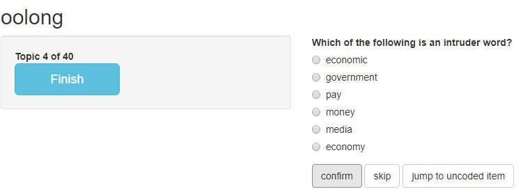

# Agenda

.pull-left[Especially with large text corpora, we may want to use methods to explore the textual content and discover meaningful patterns. Unsupervised machine learning methods structure text corpora into latent classes without much user input.

**Topic modeling** describes one family of methods to uncover such meaningful patterns in large text corpora.
]

--

.pull-right[Our agenda today:

- Topic models
  - Basics
  - Model fitting
  - Model selection
  - Model interpretation
  - Adding covariates
- Keyword-assisted topic models
  - Defining a-priori topics
  - Model fitting
  - Model selection
  - Model interpretation
- Validating topic models
]

---
class: middle

# Topic models

---

# Topic models

**Topic models** describe a family of similar methods to uncover meaningful patterns in documents based on their textual content. Among the most common methods are _LDA_ (Latent Dirichlet Allocation), _CTM_ (Correlated Topic Models), and _STM_ (Structural Topic Models).

---

# Topic models

All methods share some common assumptions:

- Text corpora consist of $D$ documents (e.g. news articles, social media posts; individual documents numbered $d_1, d_2, ...$) and $V$ terms (i.e., words; individual terms numbered $w_1, w_2, ...$). Documents can be represented as bags-of-words.
- Text corpora can be represented by $K$ latent topics which sit hierarchically between the whole corpus and invidiual documents. Each document $d_i$ and each word $w_i$ may "belong" with differing probabilities to topic $k_1, k_2, ...$ (mixed membership). $K$ has to be set by the researcher.
- We want to estimate the matrices $D \times K$ and $V \times K$ which contain the document probabilites per topic, and the word probabilities per topic, respectively.
- This is achieved by modeling a data generating process that describes the creation of documents as first drawing a probability distribution of topics for each document $d_1, d_2, ...$. For each word in document $d_i$, we then draw a topic from the document's topic distribution, and then a word from the topic's word distribution.

---

# Topic models

- The word-topic matrix $V \times K$ may then be used to describe and interpret meaning of topics $k_1, k_2, ...$, for example by looking at the words with the highest conditional probability for topic $k_j$.
- The document-topic matrix $D \times K$ may be used to assign documents to topics, for example by assinging each document $d_i$ to topic $k_j$ with the highest conditional probability.
- Different topic modeling procedures differ mainly by the probability distributions used to represent the topic probabilities. 

--

In this class, we will use _STM_ (Structural Topic Modeling) for ease of use and the ability to add covariates.

---

# Setup

Setup as usual:

```{r message=FALSE}
library(tidyverse)
library(tidytext)
library(quanteda)
library(stm)
```

```{r echo=FALSE}
guardian_models <- readRDS("offline_data/5/guardian_models.rds")
guardian_stm_40_cov <- readRDS("offline_data/5/guardian_stm_40_cov.rds")
```


---

# Setup

Load the Guardian corpus. As last time, we also create a variable for the day the article was published.

```{r eval=FALSE}
guardian_tibble <- readRDS("data/guardian_sample_2020.rds") %>% 
    mutate(day = lubridate::date(date))
```

```{r echo=FALSE}
guardian_tibble <- readRDS("temp/guardian_sample_2020.rds") %>% 
    mutate(day = lubridate::date(date))
```

--

Preprocess as usual:

```{r}
guardian_corpus <- corpus(guardian_tibble, 
                          docid_field = "id", text_field = "body")

guardian_tokens <- guardian_corpus %>% 
  tokens(remove_punct = TRUE, remove_symbols = TRUE, remove_numbers = TRUE,
         remove_url = TRUE, remove_separators = TRUE) %>% 
  tokens_tolower()

guardian_dfm <- guardian_tokens %>% 
  dfm()
```

---

# Setup

DFM trimming may affect the outcome of topic modeling quite strongly. We usually want to remove common wiords with little discriminating value and very short documents to make the topic modeling results more interpretable and reduce computational load:

```{r}
trimmed_dfm <- guardian_dfm %>% 
  dfm_trim(max_docfreq = 0.6, min_docfreq = .01, docfreq_type = "prop") %>% 
  dfm_remove(stopwords("en", source = "nltk")) %>% 
  dfm_subset(ntoken(guardian_dfm) > 5)
```

---

# Topic modeling with `stm`

We need to convert the DFM to a format suitable for the `stm` package:

```{r}
stm_dfm <- convert(trimmed_dfm, to = "stm")
str(stm_dfm, max.level = 1)
```

---

# Model fitting

To fit models, we simply use the `stm()` function. We need to provide the `documents` and the `vocab`, which are both accessible in the `stm_dfm` object. We also need to set the `K` parameter. We begin by estimating 20 topics (note that this may take quite a long time - use `verbose = TRUE` the follow the progress in the console; as topic models are initialized randomly, it may be useful to also set a `seed` to create reproducible results):

```{r eval=FALSE}
guardian_stm_20 <- stm(documents = stm_dfm$documents,
                       vocab = stm_dfm$vocab,
                       K = 20)
guardian_stm_20
```

```{r echo=FALSE}
guardian_stm_20 <- guardian_models %>% 
  filter(K == 20) %>% 
  pull(topic_model) %>% 
  .[[1]]
guardian_stm_20
```

---

# Model fitting

We can use `plot()` and `summary()` functions on the output:

```{r fig.height=5, fig.width=10}
plot(guardian_stm_20)
```

---

# Model fitting

```{r}
summary(guardian_stm_20)
```

---

# Model selection

Before we start interpreting, we need to talk about setting $K$. Apart from theoretical considerations, we may use measures such as _semantic coherence_ and _exclusivity_ to gauge the validity of topic models.

- _Semantic coherence_ increases with more words with high topic probabilities appearing in the same documents. Manual intepretation and labelling of topics is usually easier for topics with higher semantic coherence.
- _Exclusivity_ increases with more words with high probabilites for one topic having lower probabilites for other topics. 
- Both measures usually represent a trade-off: Semantic coherence can be increased simply by estimating fewer topics; exclusivity usually increases with more topics.

---

# Model selection

Compute semantic coherence with `semanticCoherence()`:

```{r}
semanticCoherence(guardian_stm_20, stm_dfm$documents)
```

---

# Model selection

Compute semantic coherence with `exclusivity()`:

```{r}
exclusivity(guardian_stm_20)
```

---

# Model selection

To investigate the common trade-off between semantic coherence and exclusivity, it is useful to plot both measures:

.pull-left[
```{r plot-k20, eval=FALSE}
tibble(
  topic = 1:20,
  exclusivity = exclusivity(guardian_stm_20),
  semantic_coherence = semanticCoherence(guardian_stm_20, stm_dfm$documents)
  ) %>% 
  ggplot(aes(semantic_coherence, exclusivity, label = topic)) +
  geom_point() +
  geom_text(nudge_y = .02) +
  theme_classic()
```
]

.pull-right[
```{r plot-k20-out, ref.label="plot-k20", echo=FALSE, fig.height=5, fig.width=6}
```
]

---

# Model selection

We can use semantic coherence and exclusivity to compare topic models with a different number `K` of topics. However, to do so, we must actually fit all models we want to compare.

--

As this may take some time, it is useful to employ parallelization to speed up the process. Using the `furrr` package, we parallelize model estimation, so depending on the number of available cores, fitting multiple models may actually on take marginally more time than fitting a single model:

```{r eval=FALSE}
library(furrr)
plan(multisession)

guardian_models <- tibble(K = c(20, 30, 40, 50, 60)) %>%
  mutate(topic_model = future_map(K, ~stm(documents = stm_dfm$documents, 
                                          vocab = stm_dfm$vocab,
                                          K = .,
                                          verbose = FALSE)))
```

---

# Model selection

We can then map the semantic coherence and exclusivity computations on the estimated models:

```{r}
model_scores <- guardian_models %>% 
  mutate(exclusivity = map(topic_model, exclusivity),
         semantic_coherence = map(topic_model, semanticCoherence, stm_dfm$documents)) %>% 
  select(K, exclusivity, semantic_coherence)

model_scores
```

---

# Model selection

...and plot the values for all models:

.pull-left[
```{r plot-many-k, eval=FALSE}
model_scores %>% 
  unnest(c(exclusivity, semantic_coherence)) %>% 
  ggplot(aes(x = semantic_coherence, y = exclusivity, color = as.factor(K))) +
  geom_point() +
  theme_classic()
```
]

.pull-right[
```{r plot-many-k-out, ref.label="plot-many-k", echo=FALSE, fig.height=5, fig.width=6}
```
]

---

# Model selection

To more easily compare models, we let's summarize both measures per model. This neatly shows the common trade-off, but it seems like the 40-topic solution may be a good start:

.pull-left[
```{r plot-many-k-sum, eval=FALSE}
model_scores %>% 
  unnest(c(exclusivity, semantic_coherence)) %>% 
  group_by(K) %>% 
  summarize(exclusivity = mean(exclusivity),
            semantic_coherence = mean(semantic_coherence)) %>% 
  ggplot(aes(x = semantic_coherence, y = exclusivity, color = as.factor(K))) +
  geom_point() +
  theme_classic()
```
]

.pull-right[
```{r plot-many-k-sum-out, ref.label="plot-many-k-sum", echo=FALSE, fig.height=5, fig.width=6}
```
]

---

# Model intepretation

Now to the fun stuff: What actually _are_ our topics? First, let's extract our (for now) final model from the many models we calculated:

```{r}
guardian_stm_40 <- guardian_models %>% 
  filter(K == 40) %>% 
  pull(topic_model) %>% 
  .[[1]]

guardian_stm_40
```

---

# Model intepretation

We can extract the most important words per topic with the `labelTopics()` function. Apart from the actual word probabilities per topic, this also includes three additional ways of finding important words. For example, `FREX` (*frequency-exclusivity*) is the ratio of word frequency and word exclusivity per topic. 

```{r}
terms <- labelTopics(guardian_stm_40)
terms
```

---

# Model intepretation

**Exercise 1: Topic model interpretation**

Try to label the topics from this model. Are there any topics that are problematic or stick out otherwise?

<center></center>

---

# Model intepretation

To extract the actual probability values, let's make use of the good ol' `tidy()` function again. If applied to an STM object, this by default extracts the $V \times K$ matrix (called $\beta$ in STM):

```{r}
terms_probs <- tidy(guardian_stm_40, matrix = "beta")
terms_probs
```

---

# Model interpretation

All beta values add up to `1` per topic:

```{r}
terms_probs %>% 
  group_by(topic) %>% 
  summarise(sum_beta = sum(beta))
```


---

# Model interpretation

To extract the $D \times K$ matrix (called $\gamma$ in STM), simply pass `matrix = "gamma"` to `tidy()`:

```{r}
doc_probs <- tidy(guardian_stm_40, matrix = "gamma", document_names = stm_dfm$meta$title)
doc_probs
```

---

# Model interpretation

Gamma values add up to `1` per document:

```{r}
doc_probs %>% 
  group_by(document) %>% 
  summarise(sum_gamma = sum(gamma))
```

---

# Model interpretation

One common way of reporting topic models is by plotting topic proportions and most important words together:

```{r plot-docs-words, eval=FALSE}
top_terms <- tibble(topic = terms$topicnums,
                    frex = apply(terms$frex, 1, paste, collapse = ", "))

gamma_by_topic <- doc_probs %>% 
  group_by(topic) %>%
  summarise(gamma = mean(gamma)) %>%
  arrange(desc(gamma)) %>%
  left_join(top_terms, by = "topic") %>%
  mutate(topic = paste0("Topic ", topic),
         topic = reorder(topic, gamma))

gamma_by_topic %>% 
  ggplot(aes(topic, gamma, label = frex, fill = topic)) +
  geom_col(show.legend = FALSE) +
  geom_text(hjust = 0, nudge_y = 0.0005, size = 3) +
  coord_flip() +
  scale_y_continuous(expand = c(0, 0), limits = c(0, 0.11), labels = scales::percent) +
  theme_classic() +
  theme(panel.grid.minor = element_blank(), panel.grid.major = element_blank()) +
  labs(x = NULL, y = expression(gamma))
```

---

# Model interpretation

```{r plot-docs-words-out, ref.label="plot-docs-words", echo=FALSE, fig.height=7, fig.width=14}
```

---

# Model interpretation

Of course, we can now also make use of other document variables, for example, to show topic distribution over time. For example, let's compare topic `14` (US election terms) and `32` (Brexit terms):

```{r plot-topics-time, eval=FALSE}
doc_probs %>% 
  left_join(guardian_tibble, by = c("document" = "title")) %>% 
  mutate(day = lubridate::date(date)) %>% 
  group_by(topic, day) %>% 
  summarise(n = n(),
            gamma = mean(gamma), 
            .groups = "drop") %>% 
  mutate(topic = as_factor(topic)) %>% 
  filter(topic %in% c(14, 32)) %>% 
  ggplot(aes(x = day, y = gamma, color = topic, fill = topic)) +
  geom_line(size = 1) +
  theme_classic() +
  theme(panel.grid.minor = element_blank(),
        panel.grid.major.x = element_blank(),
        legend.position = "bottom") +
  scale_y_continuous(expand = c(0, 0), limits = c(0, 0.2), labels = scales::percent) +
  labs(x = "Date", y = expression(gamma), color = "Topic", fill = "Topic")
```

---

# Model interpretation

```{r plot-topics-time-out, ref.label="plot-topics-time", echo=FALSE, fig.height=7, fig.width=14}
```

---

# Adding covariates

Apart from just comparing topics by document meta variables after modeling, we can also explicitly model relationships between topics and those variables by adding them as covariates that predict topic prevalance in the model:

```{r eval=FALSE}
guardian_stm_40_cov <- stm(documents = stm_dfm$documents,
                           vocab = stm_dfm$vocab,
                           prevalence = ~ stm_dfm$meta$pillar,
                           K = 40,
                           verbose = FALSE)
guardian_stm_40_cov
```

```{r echo=FALSE}
guardian_stm_40_cov
```

---

# Adding covariates

We can then extract the effects with `estimateEffect()` function:

```{r}
stm_40_effects <- estimateEffect(1:40 ~ pillar, guardian_stm_40_cov, stm_dfm$meta)
```

--

This provides regression tables per topic for the covariate effects:

```{r}
summary(stm_40_effects, topics = c(14))
```

---

# Adding covariates

STM effects objects also have a `plot()` function:

```{r fig.height=5, fig.width=10}
plot(stm_40_effects, covariate = "pillar", topics = c(14, 36))
```

---

# Adding covariates

Use the `stiminsights` package to extract the values and have more options in plotting covariate effects:

.pull-left[
```{r plot-cov, eval=FALSE}
stminsights::get_effects(stm_40_effects, "pillar", "pointestimate") %>% 
  filter(topic %in% c(14, 32, 36)) %>% 
  ggplot(aes(x = topic, y = proportion, ymin = lower, ymax = upper, color = value, shape = value)) + 
  geom_pointrange(position = position_dodge(.3)) +
  coord_flip() +
  theme_classic() +
  scale_y_continuous("Topic proportion", labels = scales::percent) +
  labs(x = "Topic", color = "Pillar", shape = "Pillar")
```
]

.pull-right[
```{r plot-cov-out, ref.label="plot-cov", echo=FALSE, fig.height=5, fig.width=6}
```
]

---

class: middle
# Keyword-assisted topic models

---

# Keyword-assisted topic models with `keyATM`

A more recent expansion of topic models are called **keyword-assisted topic models**. These models somewhat combine deductive and inductive approaches, by mainly following the unsupervised topic modeling procedure, but allow the specification of a-priori topics with keywords beforehand.

--

In R, the `keyATM` package may be used to fit keyword-assisted topic models:

```{r eval=FALSE}
install.packages("keyATM")
library(keyATM)
```

```{r echo=FALSE}
library(keyATM)
```

---

# Keyword-assisted topic models with `keyATM`

Again, `keyATM` uses it's own format for modeling, but also provides a conversion function:

```{r}
keyATM_docs <- keyATM_read(texts = trimmed_dfm)
```

---

# Defining a-priori topics with keywords

Let's work with the guardian corpus again, but this time, add some a-priori topics to the modell. We first create a named list of a-priori topics and associated keywords:

```{r}
keywords <- list(
  "U.S. Election" = c("biden", "trump", "election"),
  "Brexit" = c("brexit", "uk", "europe", "eu"),
  "Football" = c("football", "league", "game")
)
```

---

# Defining a-priori topics with keywords

`keyATM` kindly provides a function `visualize_keywords()` to inspect whether our keywords are actually useful by plotting their relative frequency. The authors suggest a proportion of at least 0.1% per keyword, but for larger corpora and more distinctive topics, lower numbers may be okay as well:

```{r fig.height=5, fig.width=10}
visualize_keywords(keyATM_docs, keywords)
```

---


# Model fitting

We fit the model using the `keyATM()` function using the following arguments:

- `docs` defines our DFM, which we have converted to the `keyATM` format.
- `keywords` defines our a-priori topics with associated keywords.
- `no_keyword_topics` defines the number of additional topics the model should estimate.
- `model` specifies the model type; we are going to use the simple `"base"` model, but note that you may also use additional models that, for example, allow for covariate specification. See the [offical documentation](https://keyatm.github.io/keyATM/articles/pkgdown_files/keyATM_cov.html) for more details. 

```{r eval=FALSE}
guardian_keyatm <- keyATM(docs = keyATM_docs,
                          keywords = keywords,
                          no_keyword_topics = 37,
                          model = "base")
```

```{r}
guardian_keyatm <- readRDS("offline_data/5/guardian_keyatm.rds")
```

---

# Model selection

We can measure and compare model fit using the `plot_modelfit()` function, which plots two model fit measures against the model fit iterations. *Log-likelihood* should stabilize on a high value, *perplexity* on a low value over time to indicate good model fit:

```{r fig.height=5, fig.width=10} 
plot_modelfit(guardian_keyatm)
```

---

# Model selection

We can also plot $\alpha$, the document-topic distribution prior, against model iterations. Again, values should stabilize over time to indicate good model fit. This indicates that the Brexit topic is probably not well defined by the keywords we chose:

```{r fig.height=5, fig.width=10}
plot_alpha(guardian_keyatm)
```

---

# Model interpretation

Similarly to before, `top_words()` reports the most important words per topic. Note that the checkmark symbol indicates a-priori keywords for topics, numbers in square brackets `[]` indicate keywords from a a-priori topics appearing in other topics:

```{r}
top_words(guardian_keyatm, n = 7)
```

---

# Model interpretation

Comparably, `top_docs()` reports the most important documents (index of the model DFM) per topic:

```{r}
top_docs(guardian_keyatm, n = 1)
```

---

# Model interpretation

Sadly, `keyATM` objects are not yet compatible with `tidy()`. However, we can access the $V \times K$ (called $\phi$ in this case) and $D \times K$ (called $\theta$ in this case) matrices directly from the model object:

```{r eval=FALSE}
guardian_keyatm$phi
guardian_keyatm$theta
```

---

# Model intepretation

Let's transform $\phi$ and extract the 7 most important words per topic:

```{r}
top_terms <- guardian_keyatm$phi %>% 
  t() %>% 
  as_tibble(rownames = "word") %>% 
  pivot_longer(-word, names_to = "topic", values_to = "phi") %>% 
  group_by(topic) %>% 
  top_n(7, phi) %>% 
  arrange(topic, desc(phi)) %>% 
  group_by(topic) %>% 
  summarise(top_words = paste(word, collapse = ", "), .groups = "drop")

top_terms
```

---

# Model intepretation

Similarly, extract mean topic proportions from $\theta$. Again, the proportion of the Brexit topic indicates that this was probably not the best specified topic:

```{r}
top_topics <- guardian_keyatm$theta %>% 
  as_tibble(rownames = "document") %>% 
  pivot_longer(-document, names_to = "topic", values_to = "theta") %>% 
  group_by(topic) %>% 
  summarise(mean_theta = mean(theta), .groups = "drop") %>% 
  arrange(desc(mean_theta))

top_topics
```

---

# Model intepretation

To create a similar plot as before, we can join both tibbles:

```{r plot-keyatm, eval=FALSE}
top_topics %>% 
  left_join(top_terms, by = "topic") %>%
  mutate(topic = reorder(topic, mean_theta)) %>% 
  ggplot(aes(topic, mean_theta, label = top_words, fill = topic)) +
  geom_col(show.legend = FALSE) +
  geom_text(hjust = 0, nudge_y = 0.0005, size = 3) +
  coord_flip() +
  scale_y_continuous(expand = c(0, 0), limits = c(0, 0.4), labels = scales::percent) +
  theme_bw() +
  theme(panel.grid.minor = element_blank(),
        panel.grid.major = element_blank()) +
  labs(x = NULL, y = expression(theta))
```

---

# Model interpretation

```{r plot-keyatm-out, ref.label="plot-keyatm", echo=FALSE, fig.height=7, fig.width=14}
```

---

class: middle

# Validating topic models

---

# Validating topic models

As topic models will _always_ output the desired number of topics, again, validation is key. For topic models, the following validation steps are common:

- Computing data fit indices (e.g., semantic coherence, exclusivity)
- Manually labelling and intepreting topics (duh)
- Investigating meaningful relationships of results with other variables in the data (e.g., a terrorism topic should lead to higher scores in the aftermath of terrorist attacks)

--

Furthermore, for manual validation, we usually are not able to provide gold standards, as we did not define the topics ourselves. However, two methods were developed to manually validate how good topics can be interpreted by humans:

- **Word intrusion test**: Randomly draw `n` words with high probabilities and `1` word with low probability from the same topic distribution. Human coders should then be able to identify the *intruder* word.
- **Topic intrusion test**: Randomly drawn `n` topics with high probabilities and `1` topic with low probability from the same document distribution. Human coders should then be able to identify the *intruder* topic after reading through the document.
- In both cases, we can then compute the precision of repeated word/topic intrusion tests for multiple topics/documents.

---

# Validating topic models with `oolong`

Both tests are implemented in the `oolong` package know from last time:

```{r}
library(oolong)
```

--

The workflow is quite simple:

- Use `wi()` (word intrusion), `wsi()` (word-set intrusion; variant of word intrusion with sets of words instead of single words), and `ti()` to create the test object with the model object as input.
- Use the associated method to do the actual test (`$do_xxx()`).
- `$lock()` the object to display results.
- `oolong()` objects can be cloned before doing the test to accomodate for multiple coders with `clone_oolong()`.
- Use `summarize_oolong()` to compare the results of multiple tests.

---

# Word intrusion tests

Example: Word intrusion test

```{r eval=FALSE}
# Create and clone objects
wi_test_coder_1 <- wi(guardian_stm_40_cov, userid = "Coder 1")
wi_test_coder_2 <- clone_oolong(wi_test_coder_1, userid = "Coder 2")

# Do the test
wi_test_coder_1$do_word_intrusion_test()
wi_test_coder_2$do_word_intrusion_test()

# Lock
wi_test_coder_1$lock()
wi_test_coder_2$lock()

# Summarize
summarize_oolong(wi_test_coder_1, wi_test_coder_2)
```

---

# Word intrusion tests

Example: Word intrusion test



---

# Word-set intrusion tests

**Exercise 2: Validating topic models**

Create an oolong object with `wsi()` on the `guardian_stm_40_cov` model and perform a word-set intrusion test. Good luck!

<center></center>

---

# Topic intrusion tests

**Exercise 3: Validating topic models**

Create an oolong object with `ti()` on the `guardian_stm_40_cov` model and perform a topic intrusion test. Good luck!

<center></center>

---

class: middle
# Thanks

Credits:
- Slides created with [`xaringan`](https://github.com/yihui/xaringan)
- Title image by [Marjan Blahn / Unsplash](https://unsplash.com/photos/AM-Tkk_dkNU)
- Coding cat gif by [Memecandy/Giphy](https://giphy.com/gifs/memecandy-LmNwrBhejkK9EFP504)